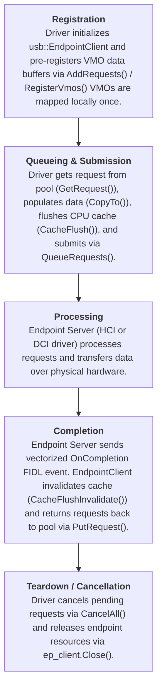

<!--
    (C) Copyright 2019 The Fuchsia Authors. All rights reserved.
    Use of this source code is governed by a BSD-style license that can be
    found in the LICENSE file.
-->

# Lifecycle of a USB request

This document describes the lifecycle of USB transfer requests in Fuchsia using the
[`fuchsia.hardware.usb.endpoint.Endpoint`][endpoint-fidl] FIDL protocol and the
[`usb::EndpointClient`][endpoint-client] helper library.

## Glossary

*   **HCI (Host Controller Interface)**: A host controller interface driver is
    responsible for servicing USB requests to hardware and managing connected
    devices in host mode.
*   **DCI (Device Controller Interface)**: A device controller interface driver is
    responsible for servicing USB requests received from or transmitted to a USB host
    when operating in peripheral mode.
*   **Endpoint Protocol**: The [`fuchsia.hardware.usb.endpoint.Endpoint`][endpoint-fidl]
    FIDL protocol that encapsulates endpoint operations, VMO registration, request queueing,
    and completion events.
*   **Endpoint Client**: The [`usb::EndpointClient`][endpoint-client] C++ helper class
    that manages endpoint connections, pre-registered VMO pools, request allocation, and
    completion event dispatching.

---

## Overview of Request Lifecycle



---

## 1. Allocation & VMO Registration

Fuchsia USB drivers pre-register VMO buffers up-front at endpoint initialization time
rather than allocating request context dynamically per transfer.

Pre-registered VMOs are associated with unique `VmoId` values using the `RegisterVmos`
FIDL method. The underlying endpoint server saves these VMOs, while `usb::EndpointClient`
maps the VMO memory into the client process and populates a thread-safe free request pool
([`usb::FidlRequestPool`][request-fidl-h]).

_**NOTE:** Pre-registered VMOs and requests are bound to the lifetime of the `Endpoint` client
channel. When `usb::EndpointClient::Close()` is called or the endpoint channel is closed, all
registered VMOs are automatically unregistered and their mapped virtual addresses are freed._

---

## 2. Submission & Cache Management

Requests are submitted to an endpoint queue using the `QueueRequests` FIDL method (or via
`usb::EndpointClient::operator->()`).

### Cache Maintenance Obligations

Because USB controllers write to or read from pre-registered physical memory regions (VMOs),
clients are responsible for maintaining CPU cache coherency:

*   **Before Outbound (TX) Write Requests**:
    The client must call `req.CacheFlush(...)` (or `zx_cache_flush` with `ZX_CACHE_FLUSH_DATA`)
    on mapped buffers to ensure written CPU data is flushed to main RAM before hardware transmission.
*   **After Inbound (RX) Read Requests**:
    Upon receiving a completion event, the client must call `req.CacheFlushInvalidate(...)`
    (or `zx_cache_flush` with `ZX_CACHE_FLUSH_DATA | ZX_CACHE_FLUSH_INVALIDATE`) on mapped
    buffers to invalidate stale CPU caches before reading data.

---

## 3. Asynchronous Completion

When hardware servicing finishes, the Endpoint server notifies the client by issuing a
vectorized FIDL event:

```fidl
strict -> OnCompletion(resource struct {
    completion vector<Completion>:REQUEST_MAX;
});
```

Each [`Completion`][endpoint-fidl] table contains:
*   `request`: The completed `fuchsia.hardware.usb.request.Request`.
*   `status`: Transfer completion status code (`zx.Status`).
*   `transfer_size`: Total bytes successfully transferred.
*   `wake_lease`: Optional wake eventpair if the transfer brought system out of suspend.

When using `usb::EndpointClient`, incoming completion events are dispatched automatically to the
driver's designated member callback function.

---

## 4. Cancellation & Shutdown

Drivers can cancel outstanding transfer requests by invoking `CancelAll()` on the endpoint client.
All pending transfers are completed asynchronously with `ZX_ERR_CANCELED` status and returned to
the caller.

During driver unbind or teardown, the driver must close endpoint clients using `ep_client.Close()`
to safely cancel pending transfers, unregister VMOs, and unbind FIDL event listeners.

---

## Modern C++ Example

The following example demonstrates how to implement a USB client driver using `usb::EndpointClient`
and `usb::FidlRequest`:

```cpp
#include <fidl/fuchsia.hardware.usb.endpoint/cpp/fidl.h>
#include <fidl/fuchsia.hardware.usb.function/cpp/fidl.h>
#include <lib/driver/component/cpp/driver_base.h>
#include <usb-endpoint/usb-endpoint-client.h>
#include <usb/request-fidl.h>

class SampleUsbDriver : public fdf::DriverBase {
 public:
  SampleUsbDriver(fdf::DriverStartArgs start_args,
                  fdf::UnownedSynchronizedDispatcher dispatcher)
      : DriverBase("SampleUsbDriver", std::move(start_args), std::move(dispatcher)),
        bulk_in_ep_(usb::EndpointType::BULK, this,
                    std::mem_fn(&SampleUsbDriver::OnBulkInComplete)) {}

  zx::result<> Start() override {
    // 1. Connect and initialize endpoint client channel
    uint8_t ep_addr = 0x81;  // IN bulk endpoint address
    zx_status_t status = bulk_in_ep_.Init(ep_addr, function_client_, dispatcher());
    if (status != ZX_OK) {
      return zx::error(status);
    }

    // 2. Pre-register VMO buffers and populate request pool (e.g. 4 buffers of 512 bytes)
    constexpr size_t kBufferCount = 4;
    constexpr size_t kMaxPacketSize = 512;
    size_t allocated = bulk_in_ep_.AddRequests(
        kBufferCount, kMaxPacketSize, fuchsia_hardware_usb_request::Buffer::Tag::kVmoId);
    if (allocated != kBufferCount) {
      return zx::error(ZX_ERR_NO_MEMORY);
    }

    // 3. Queue initial pre-buffered requests
    QueueBulkInRequests();
    return zx::ok();
  }

  void PrepareStop(fdf::PrepareStopCompleter completer) override {
    // Graceful cancellation and teardown during driver stop
    bulk_in_ep_.Close();
    completer(zx::ok());
  }

 private:
  void QueueBulkInRequests() {
    std::vector<fuchsia_hardware_usb_request::Request> reqs;

    while (!bulk_in_ep_.RequestsEmpty()) {
      auto fidl_req = bulk_in_ep_.GetRequest();
      if (!fidl_req) break;

      // Extract raw request object for FIDL transmission
      reqs.push_back(fidl_req->take_request());
    }

    if (!reqs.empty()) {
      auto result = bulk_in_ep_->QueueRequests(std::move(reqs));
      if (!result.ok()) {
        fdf::error("Failed to queue endpoint requests: {}", result.FormatDescription());
      }
    }
  }

  // 4. Vectorized completion handler
  void OnBulkInComplete(std::vector<fuchsia_hardware_usb_endpoint::Completion> completions) {
    for (auto& completion : completions) {
      zx_status_t status = completion.status().value_or(ZX_ERR_INTERNAL);
      uint64_t bytes_transferred = completion.transfer_size().value_or(0);

      if (status == ZX_OK) {
        usb::FidlRequest fidl_req(std::move(completion.request().value()));

        // Invalidate CPU cache after inbound read transfer
        fidl_req.CacheFlushInvalidate(bulk_in_ep_.GetMapped());

        // Process payload data from mapped VMO
        std::vector<uint8_t> buffer(bytes_transferred);
        fidl_req.CopyFrom(0, buffer.data(), bytes_transferred, bulk_in_ep_.GetMapped());
        ProcessData(buffer);

        // Recycle request back to free pool
        bulk_in_ep_.PutRequest(std::move(fidl_req));
      }
    }

    // Re-queue available requests to keep pipeline filled
    QueueBulkInRequests();
  }

  void ProcessData(const std::vector<uint8_t>& data) {
    // Process received packet...
  }

  fidl::ClientEnd<fuchsia_hardware_usb_function::UsbFunction> function_client_;
  usb::EndpointClient<SampleUsbDriver> bulk_in_ep_;
};
```

---

## Example USB Request Stacks

### Host Stack (HCI)

```
xHCI Host Controller -> USB Bus -> USB Core Device Driver -> Class Driver (e.g. usb-audio, usb-hid)
```

### Peripheral Stack (DCI)

```
DCI Controller (dwc3 / dwc2) -> Peripheral Core Driver -> Function Driver (e.g. usb-cdc-function, ums-function)
```

---

## See Also

+ [USB System Overview](overview.md)
+ [`fuchsia.hardware.usb.endpoint` FIDL Protocol][endpoint-fidl]
+ [`fuchsia.hardware.usb.request` FIDL Types][request-fidl]
+ [`usb::EndpointClient` C++ Helper Library][endpoint-client]

<!-- xref -->

[endpoint-fidl]: /sdk/fidl/fuchsia.hardware.usb.endpoint/endpoint.fidl
[request-fidl]: /sdk/fidl/fuchsia.hardware.usb.request/request.fidl
[endpoint-client]: /src/devices/usb/lib/usb-endpoint/include/usb-endpoint/usb-endpoint-client.h
[request-fidl-h]: /src/devices/usb/lib/usb/include/usb/request-fidl.h
