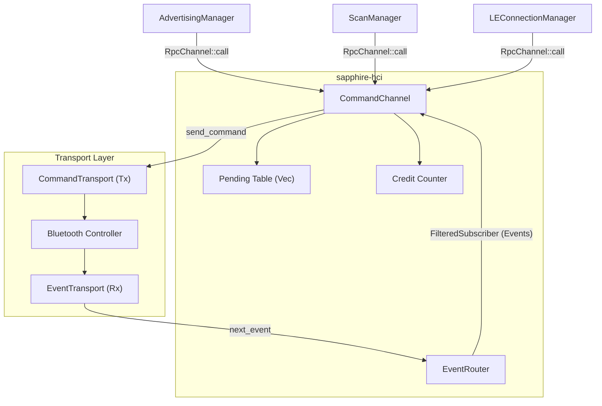
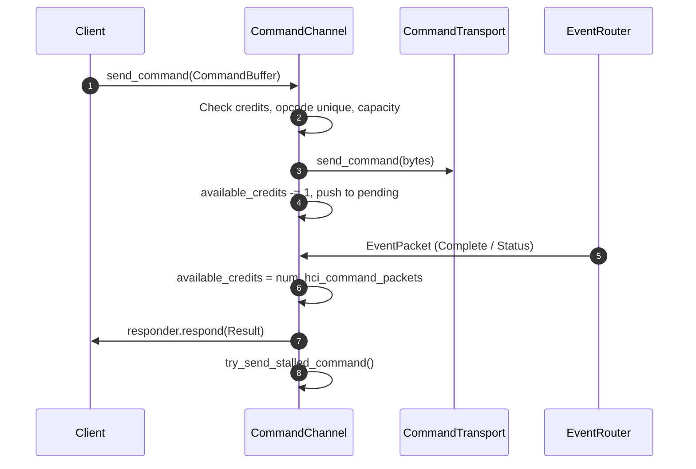

# Objective

Design and implement `CommandChannel` in the `sapphire-hci` crate.
`CommandChannel` transmits Bluetooth Host Controller Interface (HCI) commands to
a controller, enforces controller-to-host flow control via credit tracking, and
matches incoming `HCI_Command_Complete` and `HCI_Command_Status` events from
`EventRouter` to originating client requests.

`CommandChannel` allows multiple host subsystems (e.g., GAP `AccessPolicy`,
`ScanManager`, `AdvertisingManager`, `LEConnectionManager`) to issue commands
concurrently without data races or lock contention.

# Background

In the legacy C++ Sapphire stack
(`pw_bluetooth_sapphire/host/transport/command_channel.cc`):
1. Commands were queued in dynamic heap-allocated lists
   (`std::list<QueuedCommand>`) and tracked via raw pointer callbacks.
2. Event matching and timeouts relied on heap allocations and ad-hoc callback
   tables.
3. GAP procedure coordination was coupled with transport-level "exclusive
   command" opcode masks inside `CommandChannel`.

In **Sunstone**, the stack is rewritten in Rust targeting both Fuchsia and
resource-constrained embedded (`#![no_std]`) environments using zero-allocation
async primitives (`EventRouter`, `RpcChannel`, and `Buffer`).

# Requirements

## Functional Requirements

- **Credit-Based Command Flow Control**:
  - Track available controller command credits (initially 1 upon initialization
    or reset, per [Core Specification v6.2, Vol 4, Part E, Section 4.4: Command
    Flow Control]).
  - Gate command transmission on available credits and replenish credits from
    incoming `HCI_Command_Complete` and `HCI_Command_Status` events (including
    unsolicited `0x0000` No-Op credit updates).
- **Request-Response Matching**:
  - Match outgoing commands and incoming events by typed Emboss `OpCode` enum.
  - Enforce in-flight opcode uniqueness (at most one pending command per
    opcode). The specification allows multiple in-flight commands with the same
    opcode, but we are not supporting this for simplicity and robustness,
    matching the legacy C++ CommandChannel.
  - Support early error termination when a synchronous command receives a
    `Command_Status` error event.
- **EventRouter Integration & Fail-Fast Desynchronization Handling**:
  - Subscribe to `EventRouter` for `CommandComplete` and `CommandStatus` events.
  - Fail all active transactions and terminate `run()` on subscriber buffer
    overflow (`MissedMessages`) or malformed/truncated event packets so the
    supervisor can reset the controller.
- **Asynchronous RPC Client Interface**:
  - Provide strongly typed client methods (`send_command`, `send_async_command`)
    supporting multiple concurrent client handles across tasks.
- **Cancellation & Shutdown Safety**:
  - Prune cancelled requests prior to wire transmission without consuming
    controller credits.
  - Safely discard responses for in-flight commands cancelled after transmission
    while updating credits.
  - Detect channel closure (`server.wait_closed()`) when all clients drop,
    failing active transactions with `CommandError::Closed` and exiting cleanly
    even when credits are exhausted.

## Non-Functional Requirements

- **`#![no_std]` & Contiguous Buffers**: Built on contiguous `Buffer` backed by
  `dyn BufferAccessor` and configurable storage backends.
- **Bounded Memory Footprint**: Total static working set under 3 KB.

# Non-Requirements

- **GAP Procedure Arbitration**: Mutual exclusion between higher-level
  procedures is managed by GAP `AccessPolicy`, not per-command opcode exclusion
  lists.
- **Subsequent Procedure Completion Events**: Asynchronous procedures receive
  only their initial `HCI_Command_Status` from `CommandChannel`; subsequent
  events (e.g., `HCI_Disconnection_Complete`) are received directly from
  `EventRouter`.

---

# Design

## System Architecture

`CommandChannel` bridges client subsystems, the outbound `CommandTransport`, and
the shared `EventRouter`. Clients communicate with `CommandChannel` over an
`RpcChannel`, while pending commands and the current credit count are tracked
internally in `CommandChannel`.



## Core API & Data Models

### 1. Subsystem Configuration & Transport Traits

`CommandChannel` directly parameterizes its two independent subsystems:
`Broadcast: BroadcastCfg` (for `EventRouter` event subscription) and
`Rpc: RpcCfg` (for `RpcChannel` client-server queueing).
`CommandTransport` abstracts the `CommandChannel` outbound HCI command bus so
`CommandChannel` can transmit serialized command bytes independently of the
underlying driver or test double.

```rust
pub trait CommandTransport {
    /// Asynchronously transmits a serialized HCI command packet to the
    /// controller.
    async fn send_command(
        &mut self,
        payload: &[u8],
    ) -> Result<(), TransportError>;
}
```

### 2. Command Buffer (`CommandBuffer`)

HCI commands consist of a 3-byte header (2-byte OpCode + 1-byte parameter total
size) followed by up to 255 parameter bytes (`MAX_COMMAND_SIZE = 258`).
`CommandBuffer` wraps a contiguous `Buffer<'a>` backed by `dyn BufferAccessor`.
`CommandBuffer::new()` validates the command, ensuring `CommandBuffer` is a
strong type that represents a valid command. Because `Buffer` is contiguous,
validation is performed directly against `buffer.as_slice()` without
intermediate stack copies.

```rust
#[derive(Debug, Clone, Copy, PartialEq, Eq)]
pub enum CommandBufferError {
    TooShort,
    TooLong,
    InvalidOpcode,
}

pub struct CommandBuffer<'a> {
    buffer: Buffer<'a>,
}

impl<'a> CommandBuffer<'a> {
    /// Validates header length (>= 3 bytes), max packet length (<= 258 bytes),
    /// parameter length match, and non-zero opcode via Emboss
    /// `CommandHeader::check_ok()`.
    pub fn new(buffer: Buffer<'a>) -> Result<Self, CommandBufferError>;

    /// Returns the typed Emboss `OpCode` enum from the packet header.
    pub fn opcode(&self) -> sapphire_emboss::hci_common::OpCode;

    pub fn len(&self) -> usize;
    pub fn is_empty(&self) -> bool;
    pub fn as_slice(&self) -> &[u8];
    pub fn buffer(&self) -> &Buffer<'a>;
    pub fn into_buffer(self) -> Buffer<'a>;
}
```

### 3. RPC Protocol & Client Interface

`CommandChannelClient` wraps the generic `RpcChannel` client endpoint to provide
ergonomic, strongly typed methods tailored to HCI command semantics:
- `send_command` dispatches synchronous commands and awaits their
  `HCI_Command_Complete` event, returning `CommandError::UnexpectedEvent` if a
  `Command_Status` arrives instead.
- `send_async_command` dispatches procedure-initiating commands and awaits
  `HCI_Command_Status` (`SUCCESS`), returning `CommandError::Status(code)` on
  controller rejection.
- `send_command_raw` dispatches commands that may complete with either event
  type and returns the raw `CommandResponse`.

```rust
pub struct CommandRequest<'req> {
    pub buffer: CommandBuffer<'req>,
}

pub enum CommandResponse {
    CommandComplete(PublishedEventPacket),
    CommandStatus(sapphire_emboss::hci_common::StatusCode),
}

#[derive(Debug, Clone, Copy, PartialEq, Eq)]
pub enum CommandError {
    Closed,
    Cancelled,
    UnexpectedEvent,
    Status(sapphire_emboss::hci_common::StatusCode),
    Internal,
}

impl<'chan, 'req, Rpc: RpcCfg> CommandChannelClient<'chan, 'req, Rpc> {
    /// Sends a command and awaits its `HCI_Command_Complete` event packet.
    pub async fn send_command(
        &self,
        buffer: CommandBuffer<'req>,
    ) -> Result<PublishedEventPacket, CommandError>;

    /// Sends a procedure-initiating command and awaits
    /// `HCI_Command_Status` (`SUCCESS`).
    pub async fn send_async_command(
        &self,
        buffer: CommandBuffer<'req>,
    ) -> Result<(), CommandError>;

    /// Sends a command and returns whichever event (`CommandComplete` or
    /// `CommandStatus`) arrives.
    pub async fn send_command_raw(
        &self,
        buffer: CommandBuffer<'req>,
    ) -> Result<CommandResponse, CommandError>;
}
```

### 4. Split-Borrow Channel Ownership (`'chan` and `'req`)

In `no_std` environments without `Arc`, `CommandChannel` cannot own `RpcChannel`
internally because storing `Responder` references in `self.pending` would create
a self-referential struct, and handing out client references would prevent
moving `CommandChannel` into a background task.

Instead, the caller allocates `RpcChannel` (on the stack or in static storage)
and passes `&'chan mut RpcChannel` to `CommandChannel::new(&router, &mut
rpc_channel) -> Option<(Self, CommandChannelClient<'chan, 'req, Rpc>)>`.
Separating `'req` (the lifetime of buffer memory inside `CommandBuffer<'req>`)
from `'chan` (the borrow of `RpcChannel`) allows callers to pass pool-backed
buffers without tying `'chan` to the buffer lifetime. Both halves borrow the
channel for `'chan` and can be moved into independent tasks.

### 5. CommandChannel struct

`stalled_command` holds a queued command request when there is an opcode
collision with a pending command. This is necessary because we cannot peak at
the next RPC request's opcode without removing it from the RPC queue.

```rust
pub struct CommandChannel<
    'router,
    'chan,
    'req,
    Broadcast: sapphire_async::broadcast::BroadcastCfg,
    Rpc: sapphire_async::rpc::RpcCfg,
> {
    subscriber:
        FilteredSubscriber<'router, PublishedEventPacket, Broadcast>,
    server: CommandServer<'req, 'chan, Rpc>,
    available_credits: u8,
    pending:
        Vec<
            PendingTransaction<'req, 'chan, Rpc>,
            ArrayStorage<MAX_PENDING_COMMANDS>,
        >,
    stalled_command: Option<QueuedCommand<'req, 'chan, Rpc>>,
}
```

## State Machine & Dispatch Algorithm

What follows is the typical operating procedure for sending a command with
`CommandChannel`, receiving an event, and tracking credits when there are no
errors:



### Key Loop Invariants (`CommandChannel::run`)

1. **Event-Prioritized Polling & Shutdown Detection**:
   - At the start of each iteration, any stalled command whose caller dropped
     its response future is immediately discarded.
   - Inbound controller events are always polled before new client requests
     (`select_biased!`), ensuring in-flight opcodes are retired and controller
     credits replenished before dequeuing new commands.
   - New client requests are dequeued only when credits are available and no
     command is stalled waiting for a duplicate opcode to finish.
   - When new requests cannot be accepted (e.g., credits are exhausted), the
     channel monitors client liveness instead; if all client handles are
     dropped, it fails all remaining in-flight transactions with
     `CommandError::Closed` and exits cleanly.
2. **Pre-Transmission Validation & Collision Stalling**:
   - Requests cancelled by the caller before transmission are discarded
     immediately without consuming controller credits.
   - If an incoming command's opcode is the same as a currently pending
     command, the command is held in a stalled command slot rather than
     transmitted. This means that all further commands are blocked until the
     pending command completes.
3. **Wire Transmission**:
   - Validated commands are transmitted directly from their contiguous buffer slice
     over `CommandTransport` without intermediate copying or stack allocations.
   - On successful transmission, available credits are decremented by 1 and the
     transaction is recorded in the pending table.
   - If the transport write fails, that command fails immediately without
     consuming a credit.
4. **Event Demultiplexing & Credit Replenishment**:
   - Inbound `HCI_Command_Complete` and `HCI_Command_Status` events update the
     available credit count to the controller's reported
     `Num_HCI_Command_Packets`.
   - Unsolicited No-Op (`0x0000`) events update credits without matching a
     pending transaction.
   - Events with non-zero opcodes complete their matching pending transaction:
     `SUCCESS` (`0x00`) delivers the event or status to the caller, known HCI
     error codes return `Err(CommandError::Status(code))`, and unrecognized
     status bytes fail only that transaction with `Err(CommandError::Internal)`.
   - Malformed or truncated event packets or subscriber buffer overflows
     (`MissedMessages`) indicate unrecoverable controller desynchronization: all
     pending transactions fail with `CommandError::Internal` and `run()` exits
     with an error so the supervisor can reset the controller.
   - After processing any event, if a stalled command is waiting and credits,
     table capacity, and opcode uniqueness now allow, the stalled command is
     immediately transmitted.

---

# Resource Constraints & Requirements

In the following table, we selected 8 slots for the RPC channel based on an
educated guess of the maximum number of queued commands at any given time, but
we will adjust it after experimentation. We select 3 for the size of the
pending table as most controllers have 3 or fewer HCI command credits. This
could also be adjusted down to 1 on most controllers.

| Component | Element Size | Count | Total Size |
| :--- | :--- | :--- | :--- |
| `RpcChannelInner` (Slots) | ~92B (`CommandRequest` + slot) | 8 | ~736 B |
| `stalled_command` (Hold) | ~84B (`CommandRequest` + resp) | 1 | ~84 B |
| `pending` (Table) | ~40B (`opcode`, `Responder`) | 3 | ~120 B |
| `PublishedEventPacket` (Subscriber buffer) | 260 bytes | 4 | ~1,040 bytes |
| Future State Machine | ~40B (State across await) | 1 | ~40 B |
| Working State & Mutexes | - | - | ~100 bytes |
| **Total Static Working Set** | | | **~2.12 KB** |

---

# Alternatives, Drawbacks, and Unknowns

1. **Internal `RpcChannel` Ownership vs. `'chan` Split Borrow**:
   - *Alternative*: Own `RpcChannel` inside `CommandChannel`.
   - *Rejected*: Storing `Responder` references in `self.pending` would create a
     self-referential struct, and client borrows would prevent moving
     `CommandChannel` into a spawned task (`E0505`). Borrowing an external
     `RpcChannel` for `'chan` solves both without heap `Arc`.
2. **Procedural `#[rpc]` Macro vs. Explicit `CommandChannelClient`**:
   - *Alternative*: Use `#[rpc]` from `sapphire-rpc-macro`.
   - *Rejected*: `#[rpc]` unconditionally consumes `Responder` immediately upon
     handler return. `CommandChannel` must store `Responder` in `self.pending`
     across event loop iterations until the controller's completion event
     arrives.
3. **Transport-Level Opcode Exclusion Lists vs. GAP `AccessPolicy`**:
   - *Alternative*: Re-implement C++ Sapphire's exclusive command opcode lists
     inside `CommandChannel`.
   - *Rejected*: Procedure mutual exclusion belongs in GAP `AccessPolicy`,
     keeping `CommandChannel` focused strictly on HCI wire flow control.
4. **Monolithic Duplex Transport vs. Split `CommandTransport` /
   `EventTransport`**:
   - *Alternative*: Share a single duplex transport object between `EventRouter`
     and `CommandChannel`.
   - *Rejected*: Independent TX (`CommandTransport`) and RX (`EventTransport`)
     interfaces allow `CommandChannel::run` and `EventRouter::run` to execute
     concurrently without mutex contention.

---

# Implementation Plan

### Files to Add
- `src/connectivity/bluetooth/sunstone/sapphire-hci/src/command_channel.rs`:
  Implements `CommandBuffer`, `CommandRequest`, `CommandResponse`,
  `CommandError`, `CommandChannelClient`, `CommandChannel`, and unit tests.

### Files to Modify
- `src/connectivity/bluetooth/sunstone/sapphire-hci/Cargo.toml` &
  `third_party/rust_crates/BUILD.gn`: Add dependencies (`sapphire-buffer`,
  `thiserror`).
- `src/connectivity/bluetooth/sunstone/sapphire-hci/src/lib.rs`: Export
  `command_channel`.
- `src/connectivity/bluetooth/sunstone/sapphire-emboss/BUILD.gn` & `src/lib.rs`:
  Export `hci_events` Emboss definitions (`CommandStatusEvent`).
- `src/connectivity/bluetooth/sunstone/sapphire-async/src/rpc.rs`: Add
  `Responder::is_cancelled()` and `Server::wait_closed()`.
- `src/connectivity/bluetooth/sunstone/sapphire-hci/src/transport.rs`: Add
  `CommandTransport` trait and thread-safe `MockTransport`.

### Steps
1. Export `hci_events` Emboss definitions in `sapphire-emboss`.
2. Add `Responder::is_cancelled` and `Server::wait_closed` to
   `sapphire-async::rpc`.
3. Implement `CommandBuffer`, `CommandChannelClient`, and `CommandChannel` in
   `sapphire-hci`.
4. Verify with deterministic host unit tests.

---

# Documentation & Examples

The `sapphire-hci` crate rustdoc documentation will include API documentation
for all public types and the following end-to-end example demonstrating channel
initialization, task spawning, and command dispatch:

```rust
use sapphire_hci::command_channel::{
    CommandBuffer, CommandChannel, CommandRpcChannel,
};
use sapphire_hci::events::EventRouter;

// 1. Initialize EventRouter, CommandRpcChannel, and CommandChannel
let router = EventRouter::<MyBroadcastCfg>::new();
let mut rpc_chan = CommandRpcChannel::<MyRpcCfg>::new();
let (mut cmd_channel, cmd_client) =
    CommandChannel::new(&router, &mut rpc_chan).unwrap();

// 2. Spawn EventRouter and CommandChannel tasks
scope.spawn(async move { router.run(&mut event_transport).await });
scope.spawn(async move {
    cmd_channel.run(&mut command_transport).await.unwrap()
});

// 3. Send synchronous command (HCI Reset) and await Command_Complete
let reset_buf = CommandBuffer::new(reset_buffer).unwrap();
let event = cmd_client.send_command(reset_buf).await.unwrap();

// 4. Send asynchronous command (HCI Disconnect) and await Command_Status
let disconnect_buf = CommandBuffer::new(disconnect_buffer).unwrap();
cmd_client.send_async_command(disconnect_buf).await.unwrap();
```

---

# Testing

- **Deterministic Unit Tests**: Using `MockTransport` and simulated controller
  events to test:
  - Synchronous `Command_Complete` and asynchronous `Command_Status` matching.
  - Credit exhaustion, queuing backpressure, and replenishment via completion or
    No-Op (`0x0000`) events.
  - Same-opcode serialization in `stalled_command` and pending capacity limits.
  - Known vendor opcodes (defined in Emboss `OpCode` enum) and unrecognized
    non-zero status codes.
  - Pre-transmission cancellation pruning and graceful shutdown when all clients
    drop while credits are 0.

---

# Security & Privacy

- **Strict Input & Layout Validation**:
  - `CommandBuffer::new` validates header length (`>= 3`), total length (`<=
    258`), parameter length consistency, and non-zero opcode before enqueueing.
  - Inbound event packets are validated with Emboss `check_complete()` before
    reading fields, preventing out-of-bounds reads on truncated packets.
- **Bounded Memory & Backpressure**:
  - All internal collections (`pending`, `RpcChannel`, `EventRouter`
    subscriptions) have fixed compile-time or bounded capacities, preventing
    unbounded memory growth.
  - Subscriber buffer overflows (`MissedMessages`) and corrupt event packets
    abort the channel cleanly rather than allowing silent credit
    desynchronization.

---

# Future Work

- **Stream-Based Command Transport**: Migrate `CommandTransport` to
  `DynDatagramWriteStream`.
- **Command Timeouts**: Add controller response timeout supervision (per [Core
  Specification v6.2, Vol 4, Part E, Section 4.4: Command Flow Control]).

